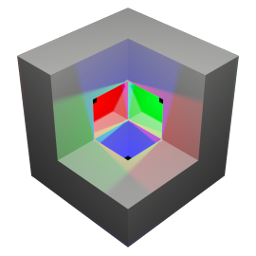

<h1>Zview -Generic mesh&cloud visualization tool</h1>

## how to run
### precompiled binaries
[WIP]
## extentions:
[WIP]

## Screenshots
[WIP]

## Compile from source

### dependencies

`sudo apt-get install libglfw3-dev libglew-dev`

`sudo apt-get install clang-format clang-tidy cppcheck`

`pip install pre-commit`
`pip install cpplint`

### refresh `compile_commands.json`
 `bazel run @hedron_compile_commands//:refresh_all`

### compile&run
`bazel run  //src:zview_binary`

