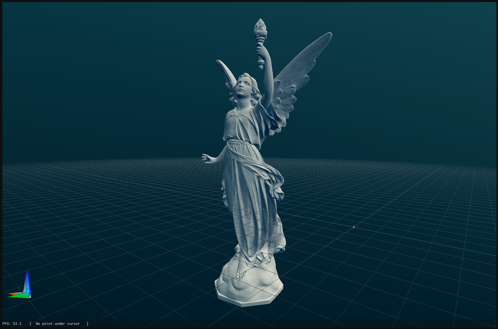

#  Zview -Generic mesh&cloud visualization tool

## how to install

### apt

`sudo add-apt-repository ppa:ohadmen/zview`
`sudo apt update`

### precompiled binaries

1. download `.deb` file from latest [release](https://github.com/ohadmen/zview/releases).
2. run `sudo dpkg -i zview_x.x.x_all.deb`

## Python extension

Sending point clouds from python is easy

### Installation

`pip install pyzview`

### Documentation

#### plot_points(namehandle, xyz, color=None, alpha=None)

* namehandle - unique shape name, with `/` to indicate tree hierarchy.
* xyz - point cloud array of size:
  * Nx3: xyz
  * Nx4 xyzi
  * Nx6 xyzrgb
  * Nx7 xyzrgba
* color should be [0-255]
  
* color (optional,defualt `w`) - color name (overides point cloud)
  * single cahr - `r`/`g`/`b`/`k`/`c`/`m`/`y`/`k`/`w` or `R` for random color
  * 3/4 vector for rgb/rgba
* alpha (optional,default 255)

#### plot_mesh(namehandle, xyz, indices, color=None, alpha=None)

* namehandle - unique shape name, with `/` to indicate tree hierarchy.
* xyz - point cloud array of size:
  * Nx3: xyz
  * Nx4 xyzi
  * Nx6 xyzrgb
  * Nx7 xyzrgba
* color should be [0-255]
* indices - array of integers of size Mx3 indicating tri mesh triplets indices
* color (optional,defualt `w`) - color name (overides point cloud)
  * single cahr - `r`/`g`/`b`/`k`/`c`/`m`/`y`/`k`/`w` or `R` for random color
  * 3/4 vector for rgb/rgba
* alpha (optional,default 255)

#### plot_edges(namehandle, xyz, indices, color=None, alpha=None)

* namehandle - unique shape name, with `/` to indicate tree hierarchy.
* xyz - point cloud array of size:
  * Nx3: xyz
  * Nx4 xyzi
  * Nx6 xyzrgb
  * Nx7 xyzrgba
* color should be [0-255]
* indices - array of integers of size Mx2 indicating edge pair indices
* color (optional,defualt `w`) - color name (overides point cloud)
  * single cahr - `r`/`g`/`b`/`k`/`c`/`m`/`y`/`k`/`w` or `R` for random color
  * 3/4 vector for rgb/rgba
* alpha (optional,default 255)

#### remove_shape(namehandle="")

* namehandle (optional) - removes a shape by name, empty string will remove all shapes.
  * Removing a shape with children will remove it and all of it's children

## Compile from source

### dependencies

`sudo apt-get install libglfw3-dev libglew-dev clang-format clang-tidy cppcheck pre-commit cpplint libstdc++-12-dev`

### refresh `compile_commands.json`

 `bazel run @hedron_compile_commands//:refresh_all`

### compile&run

`bazel run  //packaging:zview`
